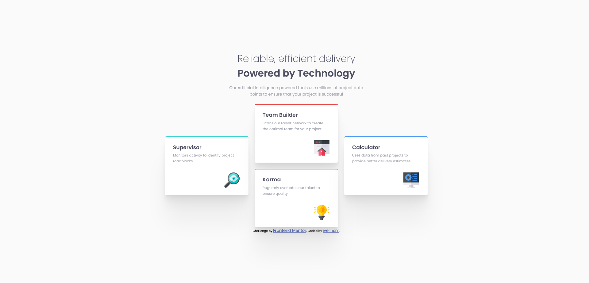

# Frontend Mentor - Four card feature section solution

This is a solution to the [Four card feature section challenge on Frontend Mentor](https://www.frontendmentor.io/challenges/four-card-feature-section-weK1eFYK). Frontend Mentor challenges help you improve your coding skills by building realistic projects. 

## Table of contents

  - [The challenge](#the-challenge)
  - [Screenshot](#screenshot)
  - [Links](#links)
- [My process](#my-process)
  - [Built with](#built-with)
  - [What I learned](#what-i-learned)
- [Author](#author)
- [Acknowledgments](#acknowledgments)

### The challenge

Users should be able to:

- View the optimal layout for the site depending on their device's screen size

### Screenshot

### Links

- Solution URL: [GitHub](https://github.com/ivelinsm/four-card-feature-section)
- Live Site URL: [GitHub Pages](https://ivelinsm.github.io/four-card-feature-section/)

## My process

  1. Started with the HTML and for the first time I tried to follow the BEM methodology, although the challenge is small and its structure is simple.
  2. Looked through both versions to take some notes for the CSS part and decided to use both Grid and Flex.
  3. Wrote the code.

### Built with

- Semantic HTML5 markup
- SASS
- Flexbox
- CSS Grid
- Mobile-first workflow
- [Shadow Generator](https://shadows.brumm.af/)

### What I learned

1. Learned about the existence of the BEM Methodology (thanks to the Frontend Mentor Community and specially @jameslegoff92)

2. Learned the difference between a wrapper and container, although a little bit late.
The <header> part should have the "wrapper" class and all of its children should become elements of the wrapper block.

## Author

- Website - [ivelinsm](https://www.your-site.com)
- Frontend Mentor - [@ivelinsm](https://www.frontendmentor.io/profile/ivelinsm)

## Acknowledgments

While looking through the solutions of other people I came accross the solution of [@jameslegoff92](https://www.frontendmentor.io/profile/jameslegoff92) which mentioned the BEM Methodology and the wrapper. 

Big thank you for the clean code and the informative README.md file.
